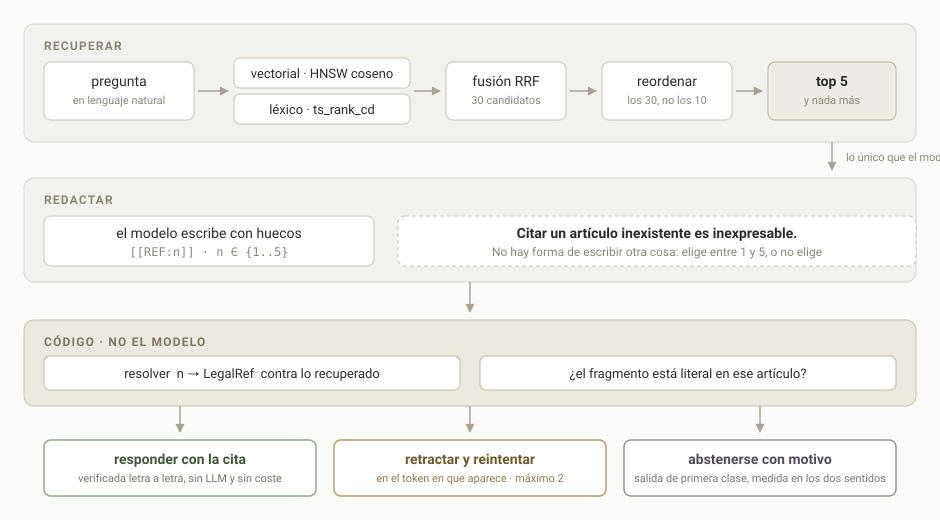
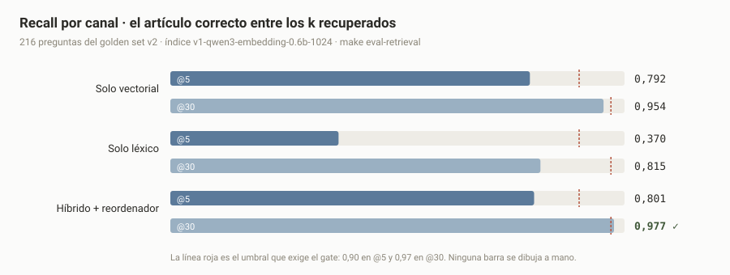

# Citebound · tutor de normativa de circulación

> Responde preguntas sobre normativa de circulación española **citando el artículo exacto**,
> verifica literalmente el fragmento que cita, y se abstiene cuando no puede verificarlo.

**No puede citar lo que no ha recuperado. Por construcción, no por buena voluntad.**

---

## Dónde está, y con qué números

Una fase **solo** se marca hecha cuando `make done MILESTONE=N` devuelve 0. No hay «casi hecho»:
el criterio de salida de cada fase es un comando que devuelve 0 o 1, y está en
[`docs/PLAN.md`](docs/PLAN.md).

- [x] **0 · Esqueleto vertical que camina** — doce condiciones en verde · [números](CHANGELOG.md)
- [x] **1 · Scoring congelado y golden set** — el corrector se cerró **antes** de anotar el primer caso · **274 casos**, 15,3 h de revisión humana
- [x] **2 · Retrieval híbrido** — `make done MILESTONE=2` → exit 0, doce de doce · `G-RECALL5` **0,801** · `G-RECALL30` **0,977** · [números en el CHANGELOG](CHANGELOG.md)
- [ ] **3 · Agente** — cita cerrada, verificación literal, abstención y reintento acotado ← **siguiente**
- [ ] **3b · Interfaz de práctica de test** — el producto. Frontera única: la API HTTP
- [ ] **4 · Evals, juez y determinismo** — que cualquiera obtenga los mismos números
- [ ] **5 · Endurecimiento y publicación** — suite adversarial, observabilidad, arranque en frío
- [ ] 6 · Personalización — **ampliación**. No hacerla no es un fallo, y se dice así

Las metas de generación —`G-HALLUC`, `G-QUOTE-LIT`, `G-CITA-PRECISION`, `G-ABST-*`— **no están
medidas**: hasta la fase 3 no hay generador, y un cero sin generador es un cero trivial. Cuando
haya resultados se publicarán con su `n`, su intervalo de confianza y el artefacto del que salen,
salgan como salgan.

---

## El problema

Un RAG normal recupera documentos, se los pasa al modelo y el modelo redacta la respuesta
*mencionando* sus fuentes. El fallo está en esa última palabra: cuando el modelo escribe
«…según el artículo 47.3…», esos caracteres son tokens que predice igual que predice el resto de
la frase. Si el fragmento recuperado era el artículo 45, **nada en el sistema se entera**. Después
se mide *faithfulness* con un juez LLM, sale 0,92, y todo el mundo se queda tranquilo.

En un dominio donde la respuesta equivocada tiene consecuencias, ese 0,92 es una opinión con
decimales.

## La solución: cita cerrada

El generador **tiene prohibido escribir referencias**. Escribe huecos numerados —`[[REF:n]]` con
`n ∈ {1..5}`— sobre los fragmentos que la búsqueda sí recuperó. La traducción de `n` a
`RD-1428/2003#art34.1` la hace **código**, nunca el modelo.



Cuatro consecuencias, y ninguna depende de que un modelo se porte bien:

| | |
|---|---|
| **Citar un artículo inexistente es inexpresable** | El modelo elige entre 1 y 5. No hay forma de escribir otra cosa |
| **Un número fuera de rango se detecta en su token** | No es un filtro sobre la respuesta ya escrita |
| **Cada fragmento entrecomillado se verifica letra a letra** | Comparación de cadenas tras normalización declarada. Sin LLM, sin coste |
| **Abstenerse es una salida de primera clase** | Y se mide en los dos sentidos, para que callarse siempre no sea la estrategia óptima |

**Lo que esto cuesta, dicho en voz alta:** si la búsqueda falla, el sistema no «se acuerda» del
artículo — se abstiene o cita peor. La calidad del retrieval deja de ser un detalle y pasa a ser
**el techo del sistema**. Por eso la fase 2 existe, y por eso se mide por separado antes y después
de reordenar.

Y hay una capa que **no** queda garantizada, solo medida: que la *interpretación* del artículo sea
correcta. Se hace determinista todo lo que puede serlo, y el residuo se acota y se publica.

---

## Retrieval, medido

216 preguntas positivas del golden set `v2`, `recall@k` como intersección de conjuntos de
`LegalRef` a nivel de artículo ([por qué a nivel de artículo](docs/PARA-SAMUEL.md)). Reproducible
con `make eval-retrieval`.



| Canal | recall@5 | recall@30 |
|---|---:|---:|
| Solo vectorial · HNSW coseno | 0,792 | 0,954 |
| Solo léxico · `ts_rank_cd` | 0,370 | 0,815 |
| Híbrido · fusión RRF | 0,727 | **0,977** |
| Híbrido + reordenador | **0,801** | **0,977** |
| *Umbral que exige el gate* | *≥ 0,80* | *≥ 0,97* |

**El híbrido es peor que el vectorial solo en el top-5 y mejor en el top-30.** No es un accidente
ni un defecto: la fusión mete candidatos léxicos que ensucian la cabeza de la lista y a cambio
ensancha la red. Justo por eso hay un reordenador — buscar más y ordenar después es más barato
que acertar a la primera.

**`G-RECALL5` bajó de 0,90 a 0,80, y conviene saber por qué.** El artículo correcto está entre los 30
en **211 de 216** casos, así que el recuperador hace su trabajo; de esos 211, el reordenador
coloca 184 en el top-5 — el 87,2 %, cuando haría falta el 92,4 %. Con 80 candidatos por canal el
artículo aparece en **216 de 216**: no falta información en ninguna parte, falta un ordenador
mejor. Y no es cuestión de tamaño — un modelo de 9B ordena **igual o peor** que el de 4B (0,843
contra 0,852) tardando un 56 % más.

Ninguno de los cinco reordenadores probados llegó a 0,90, así que el umbral se bajó a **0,80**
por la vía que el proyecto exige para eso: una propuesta escrita —**P-002**, en
[`docs/PARA-SAMUEL.md`](docs/PARA-SAMUEL.md)— con las veinte configuraciones medidas delante, y
la aprobación de una persona que además es la única que puede regenerar el candado de umbrales.
El agente no puede bajar un número por su cuenta ni aunque tenga razón, y esa fricción es
deliberada.

**0,80 deja cero margen sobre un medido de 0,8009**, y eso lo convierte en un **suelo del que no
se puede bajar** en vez de una aspiración: cualquier cambio futuro que empeore un solo caso lo
pone en rojo. Solo es sostenible porque el reordenador es determinista.

**Estos números son reproducibles byte a byte**, y no siempre lo fueron. Con el generador
puesto a ordenar, tres corridas de la misma configuración —mismo código, mismo índice,
`temperature` en 0— daban 0,852, 0,847 y 0,852: en GPU la reducción de coma flotante no es
asociativa y el *greedy* elige distinto. El cross-encoder es determinista por construcción, y
eso convierte `G-EVAL-DET` —umbral `== true`, sin propuesta admisible— de problema en propiedad.

**Todo lo que se probó y salió mal está anotado**, con su número, en
[`docs/JOURNAL.md`](docs/JOURNAL.md) — que es la mitad interesante de la fase. Entre otras cosas:
1.200 caracteres de contexto van peor que 500; una fusión RRF entre el orden de fusión y el del
reordenador da 0,782; el formato de instrucción que documenta `Qwen3-Embedding` **empeora** aquí,
en inglés y en castellano; y el reordenado por ventanas de 10 —que un diagnóstico dirigido daba
por bueno— sale diez casos peor.

**Se probaron tres troceados del corpus**, porque anclar en `LegalRef` existe justamente para
poder cambiarlo sin invalidar el golden set:

| troceado | trozos | recall@5 | recall@30 | recall@5 **estricto** |
|---|---:|---:|---:|---:|
| `articulo-v1` · uno por artículo | 235 | 0,852 | **0,977** | 0,093 |
| `apartado-v1` · uno por apartado | 569 | 0,806 | 0,968 | **0,477** |
| `multinivel-v1` · los dos niveles | 710 | 0,824 | 0,963 | 0,171 |

Gana el original en las dos metas que bloquean, y el resultado que lo explica es el contrario
del que esperaba: **con trozos afilados el reordenador aporta un caso; con trozos gruesos aporta
veintiséis.** Su valor es tapar el ruido del embedding, no juzgar mejor que él. La lectura
estricta cuenta otra historia —se multiplica por cinco al trocear fino— y es la que importará
para la precisión de cita en la fase 3.

---

## Corpus

XML **consolidado** del BOE, congelado por `sha256` en [`corpus/MANIFEST.yaml`](corpus/MANIFEST.yaml).
No PDF, no *scraping*: la fuente ya publica la jerarquía exacta y sin pérdida
([ADR-001](docs/adr/001-corpus-fuente-boe.md)).

| | |
|---|---|
| Norma | RD 1428/2003 · Reglamento General de Circulación |
| Identificador | `BOE-A-2003-23514` |
| Consolidación | 2026-07-31 |
| Contenido | 232 bloques `precepto` · **236 unidades citables** tras el parseo · 103 encabezados |
| Troceado | **235 chunks** · el artículo 51, derogado, queda fuera · 0 referencias duplicadas |

La unidad de verdad es la **`LegalRef`** (`norma#artNN.apartado`), nunca el `chunk_id`. Eso es lo
que permite cambiar el troceado, el modelo de embeddings o el reordenador sin invalidar el
conjunto de evaluación — y es exactamente lo que se hizo en la fase 2 sin tocar un solo caso.

## Golden set

**274 casos · 216 positivos · 58 negativos.** Once materias, de las cuales **ocho llegan a 20
casos o más** — las otras tres tienen 3, 2 y 1, y por eso el desglose por materia se publica
entero en [`evals/golden/STRATA.md`](evals/golden/STRATA.md) en vez de resumirse en un número.
Sellado por `sha256` en
[`evals/golden/CHECKSUMS`](evals/golden/CHECKSUMS), append-only por versión: corregir crea una
`v2` con su ADR, nunca un `sed` sobre la `v1`.

Lo que lo distingue no es el tamaño, es la procedencia. **Cada caso lo revisó Samuel a mano, uno
a uno, a lo largo de 15,3 horas**, y ningún caso entra sin revisor y sin fecha — es la regla dura
nº 3 del contrato compartido: generación asistida por LLM sí, aprobación automática no. La
trazabilidad completa está en [`evals/golden/cola/PROCEDENCIA.md`](evals/golden/cola/PROCEDENCIA.md).

Los **negativos** son la mitad interesante: preguntas que el corpus **no** responde. Sin ellos,
abstenerse siempre sería la estrategia óptima y `G-CITA-PRECISION` daría 1,00 a un sistema mudo.
Seis de ellos resultaron ser respondibles al revisarlos y cambian de bando en el montaje: si
entraran como negativos, la métrica premiaría callarse justo donde hay que hablar.

Tres casos salieron en la `v2` ([ADR-021](docs/adr/021-golden-v2-tres-casos-sin-texto.md)) con un
criterio escrito y aplicable por otro: *sale un caso si su enunciado, sin la imagen, no identifica
el supuesto de hecho.* Un primer recuento decía cinco; al leerlos enteros eran tres, y quedarse
con el número honesto costó que la meta no cerrara ese día.

---

## Stack

Python 3.12 · FastAPI + SSE · PostgreSQL 18 + pgvector 0.8.6 · LangGraph como máquina de estados
(sin LangChain) · Ollama en el host. Versiones exactas con `==` y motivo en
[`docs/STACK.md`](docs/STACK.md).

| Pieza | Modelo | Licencia |
|---|---|---|
| Embeddings | `Qwen3-Embedding-0.6B` · 1024 dim | Apache-2.0 |
| Generador | `Qwen3.5-4B` (MLX) | Apache-2.0 |
| Reordenador | `bge-reranker-v2-m3` · cross-encoder en proceso | MIT |
| Juez (fase 4) | `Gemma 4 12B` | — |

Tres precisiones que suelen darse por supuestas y aquí no lo son:

- La búsqueda léxica es `ts_rank_cd` con configuración `spanish_unaccent`, **y no se llama BM25
  porque no lo es** mientras no haya una extensión BM25 de verdad instalada.
- **El reordenador no pasa por Ollama**, que no tiene endpoint de rerank: corre en proceso con
  `sentence-transformers`. Se probó primero el camino contrario —el generador puesto a
  ordenar— y da **5 puntos más de recall** (0,852) a cambio de **once veces** el presupuesto de
  latencia, de no ser reproducible entre corridas y de no poder ejecutarse al responder. La
  comparación entera, con sus números, en [ADR-024](docs/adr/024-el-reordenador-vuelve-a-ser-un-cross-encoder.md).
- **Nada exige un Mac.** Los modelos van por Ollama o cualquier proveedor compatible con la API
  de OpenAI; el backend MLX es una elección de la máquina de desarrollo, no un requisito.

## Cómo está gobernado

Es la parte más interesante del repositorio en este momento, y probablemente lo que más se lee.

- **[`docs/GOALS.yaml`](docs/GOALS.yaml)** — 24 metas ejecutables. Cada una con umbral estructurado,
  comando de medida, artefacto y desde qué fase bloquea.
- **[`docs/RULES.md`](docs/RULES.md)** — 20 invariantes, cada uno con el comando que lo verifica.
  Una regla sin comprobación mecánica es una sugerencia, y las sugerencias se erosionan.
- **[`docs/CONSTITUCION.md`](docs/CONSTITUCION.md)** — separación entre lo que el agente puede
  escribir, lo que propone y lo que no toca jamás. Seis mecanismos anti-*gaming*.
- **[`docs/adr/`](docs/adr/)** — decisiones con sus alternativas descartadas y el coste de cada una.
- **[`docs/JOURNAL.md`](docs/JOURNAL.md)** — qué se intentó, qué falló y **qué número salió**.
- **[`docs/CONTRACTS/`](docs/CONTRACTS/)** — contratos compartidos con otros proyectos. Copias
  literales: un `diff` contra el original es un test.

Dos reglas que gobiernan de verdad: **el agente puede cambiar cómo llega al número, nunca el
número** — los umbrales están firmados con un hash y bajarlos exige una propuesta escrita. Y
**lo verificable deterministamente no se delega a un LLM**: el juez es el último recurso y solo
vale con su κ publicado.

## Empezar

```bash
make up                  # Postgres + pgvector, fijado por digest
make warm                # residencia de los modelos. NUNCA dentro de `up`: rompe el cronómetro
uv run citebound ingest  # 235 chunks desde el XML congelado
make smoke-f0            # ingesta + 3 preguntas + al menos una ref presente en refs.json
make eval-retrieval      # G-RECALL5 y G-RECALL30 contra el golden set (6 s desde cache)
make done MILESTONE=2    # la única definición de «hecho»: exit 0 o 1
```

Requiere [Ollama](https://ollama.com) **en el host** (no en compose) y Docker. `make check-ollama`
lo comprueba y dice qué falta.

---

## Fuentes

**Normativa.** Real Decreto 1428/2003, de 21 de noviembre, Reglamento General de Circulación.
Agencia Estatal Boletín Oficial del Estado, [datos abiertos](https://www.boe.es/datosabiertos/),
identificador `BOE-A-2003-23514`, consolidación 2026-07-31. Información del sector público,
reutilizable conforme a la normativa española. El texto se reproduce sin modificar.

**Banco de preguntas.** Banco de preguntas tipo test de circulación de terceros, de acceso público.
**No se redistribuye** en este repositorio en ninguna de sus versiones: lo que se publica es el
golden set derivado, con la revisión humana que lo valida. Las imágenes asociadas no se descargan,
no se procesan y no se publican.

**Modelos.** [`Qwen3-Embedding-0.6B`](https://huggingface.co/Qwen/Qwen3-Embedding-0.6B) y
[`Qwen3.5`](https://huggingface.co/Qwen), Apache-2.0, ejecutados en local vía Ollama. No se
redistribuyen.

**Método.** La fusión de canales es *Reciprocal Rank Fusion* con `k=60` — Cormack, Clarke y
Buettcher, [«Reciprocal Rank Fusion outperforms Condorcet and individual Rank Learning
Methods»](https://dl.acm.org/doi/10.1145/1571941.1572114), SIGIR 2009. El detalle completo, con
lo que no se copió y por qué, en [`docs/adr/`](docs/adr/) y
[`docs/CONTRACTS/`](docs/CONTRACTS/).

## Aviso

Este proyecto no es una fuente jurídica y sus respuestas no son asesoramiento legal. El carácter
oficial del texto normativo corresponde únicamente a su publicación en el BOE.

## Licencia

Código bajo [Apache 2.0](LICENSE). Los datos tienen procedencia y condiciones propias, declaradas
en [`NOTICE`](NOTICE).
